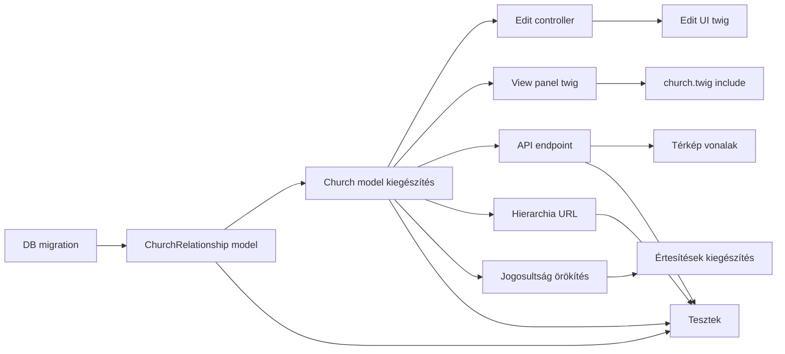

# Misézőhelyek közötti kapcsolatok – Részletes terv

## Összefoglalás

Misézőhelyek (Eloquent `Church`) közötti hierarchikus kapcsolatok összegyűjtése, megadása és megjelenítése. A kapcsolat mindig alulról felfelé értelmezett: az alsóbb misézőhely tartozik a felsőbbhöz valamilyen típusú viszonnyal.

---

## 1. Fogalmak és i18n

### 1.1 Misézőhely rangja (`church_rank`)

A misézőhely saját besorolása – ez **nem** a kapcsolat típusa, hanem a misézőhely önálló jellemzője. Az adatbázisban angol kulcsszóként tárolódik, a megjelenítés i18n-en keresztül történik.

| Angol kulcs (DB/kód) | Magyar | Térkép ikon |
|---|---|---|
| `parish` | plébánia | teli kör |
| `assisted_parish` | oldallagosan ellátott plébánia | félkör |
| `filial_church` | fília | üres/lyukas kör |
| `mass_station` | misézőhely | kis pont |
| `rectorate` | templomigazgatóság | négyzet |

### 1.2 Kapcsolat típusa (`relationship_type`)

A két misézőhely közötti viszony leírása. Három típus van, angol kulcsszóként tárolódik az adatbázisban. **A PHP/Eloquent kód csak az angol kulcsokat ismeri** – a fordítás kizárólag a Twig sablonokban és a JS scriptekben történik i18n-nel.

| Angol kulcs (DB/kód) | Magyar megnevezés | Térkép megjelenítés |
|---|---|---|
| `subordinate` | alá-fölé rendelt | folytonos vonal, nyíl |
| `associated` | mellérendelt | szaggatott vonal, kétirányú nyíl |
| `territorially_independent` | területileg ott van, de lényegében független | pontozott vonal, más szín |

**Megjegyzés:** A `territorially_independent` esetén a gyerek-templom területileg a szülő területén van, de önállóan működik (pl. templomigazgatóság). A gyerek-szülő irány mindig megmarad az adatbázisban.

### 1.3 i18n kulcsok – `webapp/i18n/hu.json`

Fájl: [`webapp/i18n/hu.json`](../webapp/i18n/hu.json)

Az i18n kulcsok **csak** a Twig sablonokban és a JS scriptekben használatosak. A PHP Eloquent modellek és controllerek kizárólag az angol kulcsszavakat kezelik – `t()` hívás nem kerül az Eloquent modellekbe.

```json
"CHURCH_RANK": {
  "parish":           "plébánia",
  "assisted_parish":  "oldallagosan ellátott plébánia",
  "filial_church":    "fília",
  "mass_station":     "misézőhely",
  "rectorate":        "templomigazgatóság",
  "unknown":          "ismeretlen"
},
"CHURCH_RELATIONSHIP_TYPE": {
  "subordinate":              "alá-fölé rendelt",
  "associated":               "mellérendelt",
  "territorially_independent": "területileg ott van, de lényegében független"
}
```

Twig-ben: `{{ ('CHURCH_RANK.' ~ church.rank)|t }}`
JS-ben: `i18n['CHURCH_RANK'][rank]` (a `hu.json` betöltve a frontendre)
API válaszban: mindig az angol kulcs megy, a frontend fordítja.

---

## 2. Adatbázis

### 2.1 Új tábla: `church_relationships`

Fájl: [`docker/mysql/initdb.d/03-migrations.sql`](../docker/mysql/initdb.d/03-migrations.sql)

```sql
CREATE TABLE IF NOT EXISTS `church_relationships` (
  `id` int(11) NOT NULL AUTO_INCREMENT,
  `parent_church_id` int(11) NOT NULL COMMENT 'felsőbbrendű misézőhely',
  `child_church_id`  int(11) NOT NULL COMMENT 'alsóbbrendű misézőhely',
  `type` enum(
    'subordinate',
    'associated',
    'territorially_independent'
  ) NOT NULL COMMENT 'kapcsolat típusa',
  `created_at` timestamp NULL DEFAULT current_timestamp(),
  `updated_at` timestamp NULL DEFAULT NULL ON UPDATE current_timestamp(),
  PRIMARY KEY (`id`),
  UNIQUE KEY `unique_pair` (`parent_church_id`, `child_church_id`),
  KEY `parent_idx` (`parent_church_id`),
  KEY `child_idx`  (`child_church_id`),
  CONSTRAINT `fk_cr_parent` FOREIGN KEY (`parent_church_id`)
    REFERENCES `templomok` (`id`) ON DELETE CASCADE,
  CONSTRAINT `fk_cr_child`  FOREIGN KEY (`child_church_id`)
    REFERENCES `templomok` (`id`) ON DELETE CASCADE
) ENGINE=InnoDB DEFAULT CHARSET=utf8mb3 COLLATE=utf8mb3_uca1400_ai_ci;
```

### 2.2 `templomok` tábla kiegészítése: `rank` oszlop

A misézőhely rangjának tárolásához új oszlop a `templomok` táblában:

```sql
ALTER TABLE `templomok`
  ADD COLUMN `rank` enum(
    'parish',
    'assisted_parish',
    'filial_church',
    'mass_station',
    'rectorate'
  ) NULL DEFAULT NULL COMMENT 'misézőhely rangja' AFTER `miseaktiv`;
```

**Megjegyzés:** `NULL` = ismeretlen/nem megadott rang. A rang megadása opcionális, de a térkép ikonok és a hierarchia megjelenítés ezt használja.

### 2.3 Enum típusok összefoglalója

Lásd az 1.1 és 1.2 fejezeteket.

**Megjegyzés:** Az `independent_parish` esetén a templomigazgatóság a **gyerek** (child), még ha önálló is – a felsőbb plébánia területén van.

---

## 3. Eloquent modellek

### 3.1 Új model: `ChurchRelationship`

Fájl: [`webapp/classes/eloquent/churchrelationship.php`](../webapp/classes/eloquent/churchrelationship.php)

A PHP Eloquent modell **csak az angol kulcsszavakat** kezeli. Fordítás (`t()`) nem kerül az Eloquent modellbe – az kizárólag a Twig sablonok és JS scriptek feladata.

```php
namespace Eloquent;

class ChurchRelationship extends \Illuminate\Database\Eloquent\Model {
    protected $table = 'church_relationships';
    protected $fillable = ['parent_church_id', 'child_church_id', 'type'];

    public function parent() {
        return $this->belongsTo(Church::class, 'parent_church_id');
    }

    public function child() {
        return $this->belongsTo(Church::class, 'child_church_id');
    }

    /** Érvényes kapcsolat típus kulcsok (angol, DB enum értékek) */
    public static function validTypes(): array {
        return ['subordinate', 'associated', 'territorially_independent'];
    }

    /** Érvényes rang kulcsok (angol, DB enum értékek) */
    public static function validRanks(): array {
        return ['parish', 'assisted_parish', 'filial_church', 'mass_station', 'rectorate'];
    }
}
```

### 3.2 Módosítás: `Church` model

Fájl: [`webapp/classes/eloquent/church.php`](../webapp/classes/eloquent/church.php)

Új relációk és attribútumok:

```php
// rank hozzáadása a fillable-höz
protected $fillable = [
    /* ... meglévők ... */
    'rank',
];

// Relációk
public function parentRelationships() {
    return $this->hasMany(ChurchRelationship::class, 'child_church_id');
}

public function childRelationships() {
    return $this->hasMany(ChurchRelationship::class, 'parent_church_id');
}

// Rekurzív felfelé járás (max 10 szint, ciklus-védelem visited set-tel)
// Visszatér: [ ['church' => Church, 'type' => 'filia', 'type_label' => '...', 'children' => [...]], ... ]
public function getAncestorsAttribute(): array {
    return $this->_getAncestors([$this->id]);
}
private function _getAncestors(array $visited, int $depth = 0): array { /* ... */ }

// Rekurzív lefelé járás (max 10 szint, ciklus-védelem visited set-tel)
public function getDescendantsAttribute(): array {
    return $this->_getDescendants([$this->id]);
}
private function _getDescendants(array $visited, int $depth = 0): array { /* ... */ }

// Lapos ID lista: saját id + összes leszármazott id (Angular hierarchia URL-hez)
public function getDescendantIdsAttribute(): array { /* ... */ }

// Örökölt gondnokok: az összes os church_holders 'allowed' rekordjai
public function getInheritedHoldersAttribute() { /* ... */ }

```

**Rekurzió védelme:** Mindkét rekurzív metódus kap egy `$visited = []` paramétert, amelybe belekerül minden meglátogatott `church_id`. Ha egy id már szerepel benne, a rekurzió megáll (körkörös kapcsolat esetén sem végtelen hurok). Maximum mélység: 10 szint.

**Fontos:** A `Church` modell **nem tartalmaz** `t()` hívást. A `rank` értéke az adatbázisból angolul jön ki, és a Twig sablon fordítja le: `{{ ('CHURCH_RANK.' ~ church.rank)|t }}`.

**Törlés – kapcsolatok kaszkád törlése:** A `Church::delete()` metódust ki kell egészíteni, hogy a templomhoz tartozó összes kapcsolatot törölje **mindkét irányban** (akár szülőként, akár gyerekként szerepel):

```php
public function delete() {
    // Kapcsolatok törlése mindkét irányban
    ChurchRelationship::where('parent_church_id', $this->id)->delete();
    ChurchRelationship::where('child_church_id', $this->id)->delete();

    // ... meglévő törlési logika (boundaries, holders, stb.) ...
    parent::delete();
}
```

A DB szinten `ON DELETE CASCADE` is be van állítva a `church_relationships` táblán (lásd 2.1), így a DB-szintű integritás garantált. Az Eloquent szintű explicit törlés azért szükséges, hogy az Eloquent eseménykezelők (pl. logolás) is lefussanak.

---

## 3. Jogosultságok és örökölt gondnokság

### 3.1 Alapelv

- Aki szerkesztheti a templomot (`writeAccess`), megadhatja a felette álló templomot.
- A felső templom gondnoka **automatikusan** jogosult az alá beosztott templomok szerkesztésére is – de ezt **nem írjuk be** a `church_holders` táblába egyesével.
- Az örökölt jogosultságot a `Church::checkWriteAccess()` metódus számítja ki dinamikusan, az ős-lánc `church_holders` rekordjait végigvizsgálva.

### 3.2 `checkWriteAccess()` módosítása

Fájl: [`webapp/classes/eloquent/church.php`](../webapp/classes/eloquent/church.php)

```php
function checkWriteAccess($_user) {
    // ... meglévő ellenőrzések ...

    // Örökölt gondnokság: ha a felhasználó bármely ős-templomnak 'allowed' gondnoka
    foreach ($this->ancestors as $ancestor) {
        if (\Eloquent\ChurchHolder::where('church_id', $ancestor['church']->id)
            ->where('user_id', $_user->uid)
            ->where('status', 'allowed')
            ->exists()) {
            $access = true;
            break;
        }
    }
    return $access;
}
```

### 3.3 Értesítések (email/észrevételek)

Az észrevételek és frissítési értesítők küldésekor az alsóbb templomok esetén az összes ős-lánc gondnokait is értesíteni kell.

Érintett fájl: [`webapp/classes/user.php`](../webapp/classes/user.php) – a `sendNotifications()` / értesítő logika kiegészítése: az adott `church_id` ős-lánca mentén összegyűjtött `church_holders` 'allowed' felhasználóit is belevenni az értesítendők listájába.

### 3.4 Edit oldal gondnokok panel

Fájl: [`webapp/templates/church/edit.twig`](../webapp/templates/church/edit.twig)

A gondnokok/felelősök panelben megjelenítjük az örökölt gondnokokat is, külön jelölve:

```
Gondnokok:
  [saját] Kovács János (allowed)
  [örökölt, Anyaplébánia] Nagy Péter (allowed, örökölt)
```

---

## 4. Szerkesztő UI (`/templom/:id/edit`)

### 4.1 Twig sablon módosítás

Fájl: [`webapp/templates/church/edit.twig`](../webapp/templates/church/edit.twig)

**Rang (rank) megadása** – új sor a form elején:
```html
<tr>
  <td>Misézőhely rangja:</td>
  <td>
    <select name="church[rank]">
      <option value="">– ismeretlen –</option>
      {# Az option értékek angolul, a szöveg Twig i18n-nel #}
      
        <option value="{{ rankKey }}" selected>
          {{ ('CHURCH_RANK.' ~ rankKey)|t }}
        </option>
      
    </select>
  </td>
</tr>
```

Új szekció a form alján, „Kapcsolat más misézőhelyekkel" fejléccel:

**Meglévő kapcsolatok listája:**
```twig
<table>
  
  <tr>
    <td>
      <a href="/templom/{{ rel.parent.id }}">{{ rel.parent.names.0 }}</a>
      ({{ rel.parent.varos }})
      – {{ ('CHURCH_RELATIONSHIP_TYPE.' ~ rel.type)|t }}
    </td>
    <td>
      <button name="relationship[delete]" value="{{ rel.id }}">Törlés</button>
    </td>
  </tr>
  
</table>
```

**Új kapcsolat hozzáadása – egyszerű szerver-oldali legördülő:**

Az oldal betöltésekor a PHP controller betölti a 20 legközelebbi templomot (koordináta alapján, a `distances` tábla vagy `ST_distance_sphere` segítségével), és ezeket adja át a Twig sablonnak. Nincs AJAX, nincs autocomplete – egyszerű `<select>`.

```twig
<select name="relationship[parent_id]">
  <option value="">– válassz templomot –</option>
  
    <option value="{{ nearby.id }}">
      {{ nearby.varos }} – {{ nearby.names.0 }}
      (~{{ nearby.distance_km|round(1) }} km)
    </option>
  
</select>
<select name="relationship[type]">
  
    <option value="{{ typeKey }}">{{ ('CHURCH_RELATIONSHIP_TYPE.' ~ typeKey)|t }}</option>
  
</select>
<button name="relationship[add]" value="1">Hozzáadás</button>
```

**PHP controller – `nearbyChurches` előkészítése** (`preparePage()` metódusban):
```php
$this->nearbyChurches = \Eloquent\Church::select()
    ->addSelect(DB::raw("ST_distance_sphere(
        ST_GeomFromText('POINT ({$this->church->lat} {$this->church->lon})', 4326),
        ST_GeomFromText(CONCAT('POINT (', lat, ' ', lon, ')'), 4326)
    ) / 1000 as distance_km"))
    ->where('ok', 'i')
    ->where('id', '!=', $this->tid)
    ->whereRaw('NOT (lat = 0 AND lon = 0)')
    ->orderBy('distance_km', 'ASC')
    ->limit(20)
    ->get();
```

### 4.2 Controller módosítás – `modify()`

Fájl: [`webapp/classes/html/church/edit.php`](../webapp/classes/html/church/edit.php)

```php
// Rang mentése
if (array_key_exists('rank', $this->input['church'])) {
    $rank = $this->input['church']['rank'];
    $validRanks = \Eloquent\ChurchRelationship::validRanks();
    $this->church->rank = (in_array($rank, $validRanks)) ? $rank : null;
}

// Kapcsolat hozzáadása
if (isset($this->input['relationship']['add']) && !empty($this->input['relationship']['parent_id'])) {
    $parentId = (int) $this->input['relationship']['parent_id'];
    $type = $this->input['relationship']['type'];
    $validTypes = \Eloquent\ChurchRelationship::validTypes();
    if (in_array($type, $validTypes) && $parentId !== (int)$this->tid) {
        \Eloquent\ChurchRelationship::updateOrCreate(
            ['parent_church_id' => $parentId, 'child_church_id' => $this->tid],
            ['type' => $type]
        );
    }
}

// Kapcsolat törlése
if (isset($this->input['relationship']['delete'])) {
    $relId = (int) $this->input['relationship']['delete'];
    $rel = \Eloquent\ChurchRelationship::find($relId);
    // Csak akkor törölheti, ha a child_church_id == $this->tid (saját kapcsolat)
    if ($rel && (int)$rel->child_church_id === (int)$this->tid) {
        $rel->delete();
    }
}
```

---

## 5. Megjelenítő panel (`/templom/:id`)

### 5.1 Új Twig partial

Fájl: [`webapp/templates/church/_panelrelationships.twig`](../webapp/templates/church/_panelrelationships.twig)

```twig

<div class="panel panel-default">
  <div class="panel-heading">Egyházi kapcsolatok</div>
  <div class="panel-body">

    
    <h5>Fölötte áll:</h5>
    {# Rekurzív macro a fa megjelenítéséhez #}
    {{ _self.renderTree(ancestors) }}
    

    
    <h5>Alá tartozik:</h5>
    {{ _self.renderTree(descendants) }}
    

  </div>
</div>



<ul>
  
  <li>
    <a href="/templom/{{ node.church.id }}">{{ node.church.names.0 }}</a>
    ({{ node.church.varos }})
    – <em>{{ node.type_label }}</em>
    
      {{ _self.renderTree(node.children) }}
    
  </li>
  
</ul>

```

### 5.2 `church.twig` módosítás

Fájl: [`webapp/templates/church/church.twig`](../webapp/templates/church/church.twig)

```twig

```

### 5.3 `church.php` controller módosítás

Fájl: [`webapp/classes/html/church/church.php`](../webapp/classes/html/church/church.php)

```php
$this->ancestors   = $this->church->ancestors;
$this->descendants = $this->church->descendants;
```

---

## 6. API végpont

### 6.1 `GET /api/church/:id/relationships`

Fájl: [`webapp/classes/api/church.php`](../webapp/classes/api/church.php)

Visszaad egy JSON objektumot:

```json
{
  "ancestors": [
    {
      "church": { "id": 10, "name": "Anyaplébánia", "city": "Budapest", "lat": 47.5, "lon": 19.0 },
      "type": "subordinate",
      "children": []
    }
  ],
  "descendants": [
    {
      "church": { "id": 20, "name": "Kápolna", "city": "Budapest", "lat": 47.51, "lon": 19.01 },
      "type": "associated",
      "children": []
    }
  ]
}
```

Ezt a térképes megjelenítés AJAX-szal hívja.

---

## 7. Térkép megjelenítés

### 7.1 Kapcsolatvonalak (opcionális réteg)

Fájl: [`webapp/templates/_map_leaflet.twig`](../webapp/templates/_map_leaflet.twig)

- Leaflet layer control: „Kapcsolatok" réteg (alapból kikapcsolt)
- A réteg bekapcsolásakor AJAX hívás a látható templomok kapcsolataihoz
- Vonalak rajzolása `L.polyline`-nal:

```javascript
var relationshipStyles = {
    'subordinate':              { color: '#3388ff', dashArray: null,   weight: 2 },
    'associated':               { color: '#33aa33', dashArray: '4, 4', weight: 2 },
    'territorially_independent':{ color: '#aa33aa', dashArray: '8, 4', weight: 2 }
};
```

- Nyilak: `leaflet-polylinedecorator` plugin (már be van töltve a `_map_leaflet.twig`-ben a `Leaflet.TextPath` révén – vagy külön betöltjük)

### 7.2 Differenciált ikonok

Az ikonok a `rank` mező alapján különböznek (nem a kapcsolat típusa alapján). Az API a `rank` értéket visszaadja minden templomhoz.

| `rank` érték | Ikon | i18n kulcs |
|---|---|---|
| `parish` | Teli kör | `CHURCH_RANK.parish` |
| `assisted_parish` | Félkör | `CHURCH_RANK.assisted_parish` |
| `filial_church` | Üres/lyukas kör | `CHURCH_RANK.filial_church` |
| `mass_station` | Kis pont | `CHURCH_RANK.mass_station` |
| `rectorate` | Négyzet | `CHURCH_RANK.rectorate` |
| `null` | Alapértelmezett kör | – |

Az ikonokat SVG-ként vagy `L.divIcon`-ként definiáljuk, CSS osztályokkal. A térkép JS-ben az angol `rank` kulcsot kapja az API-tól, és a megjelenítési logika ez alapján választ ikont – a felirathoz a `hu.json` i18n kulcsait használja.

---

## 8. Hierarchia URL (Angular számára)

### 8.1 Új controller

Fájl: [`webapp/classes/html/church/hierarchia.php`](../webapp/classes/html/church/hierarchia.php)

```php
namespace Html\Church;

class Hierarchia extends \Html\Html {
    public function __construct($path) {
        $tid = (int) $path[0];
        $church = \Eloquent\Church::find($tid);
        if (!$church) throw new \Exception('Nincs ilyen templom.');

        $ids = $church->descendantIds; // [tid, child1, child2, ...]

        header('Content-Type: application/json');
        echo json_encode(['ids' => $ids]);
        exit;
    }
}
```

### 8.2 Útvonal regisztráció

Fájl: [`webapp/classes/path.php`](../webapp/classes/path.php)

```php
["^templom\/([0-9]{1,5})\/hierarchia$", "church/hierarchia/$1"],
```

Ez a sor a meglévő `^templom\/([0-9]{1,5})` sor **elé** kerül.

**Visszatérési formátum:**
```json
{ "ids": [42, 101, 205, 310] }
```

---

## 9. Tesztek

### 9.1 Unit / Integration tesztek

Fájl: [`webapp/tests/Integration/ChurchRelationshipTest.php`](../webapp/tests/Integration/ChurchRelationshipTest.php)

```
ChurchRelationshipTest
  ✓ testCanCreateRelationship
  ✓ testCannotCreateSelfRelationship
  ✓ testCannotCreateDuplicateRelationship
  ✓ testDeleteCascadesWhenChurchDeleted
  ✓ testGetAncestorsReturnsCorrectChain
  ✓ testGetDescendantsReturnsCorrectTree
  ✓ testCircularRelationshipDoesNotCauseInfiniteLoop
  ✓ testGetDescendantIdsIncludesSelf
  ✓ testInheritedWriteAccessFromAncestorHolder
  ✓ testNonAncestorHolderHasNoInheritedAccess
  ✓ testTypeLabelReturnsHungarianText
  ✓ testAllEnumTypesAreValid
```

Minta teszt struktúra (a `NaprakeszTest` mintájára, tranzakcióval):

```php
class ChurchRelationshipTest extends TestCase {
    protected function setUp(): void {
        parent::setUp();
        DB::beginTransaction();
    }
    protected function tearDown(): void {
        DB::rollBack();
        parent::tearDown();
    }

    private function createChurch(string $name = 'Teszt'): int {
        return DB::table('templomok')->insertGetId([
            'nev' => $name, 'varos' => 'Budapest',
            'frissites' => '2020-01-01', 'ok' => 'i',
            'plebania' => '', 'leiras' => '', 'megjegyzes' => '',
            'misemegj' => '', 'bucsu' => '', 'adminmegj' => '', 'log' => '',
            'lat' => 47.5, 'lon' => 19.0,
        ]);
    }

    public function testCircularRelationshipDoesNotCauseInfiniteLoop(): void {
        $a = $this->createChurch('A');
        $b = $this->createChurch('B');
        $c = $this->createChurch('C');
        // A -> B -> C -> A (kör)
        DB::table('church_relationships')->insert([
            ['parent_church_id' => $a, 'child_church_id' => $b, 'type' => 'filia'],
            ['parent_church_id' => $b, 'child_church_id' => $c, 'type' => 'filia'],
            ['parent_church_id' => $c, 'child_church_id' => $a, 'type' => 'filia'],
        ]);
        $church = \Eloquent\Church::find($a);
        // Nem szabad végtelen hurokba esni
        $descendants = $church->descendants;
        $this->assertIsArray($descendants);
    }
}
```

### 9.2 API tesztek

Fájl: [`webapp/tests/Api/ChurchRelationshipApiTest.php`](../webapp/tests/Api/ChurchRelationshipApiTest.php)

```
ChurchRelationshipApiTest
  ✓ testRelationshipsEndpointReturnsJson
  ✓ testRelationshipsEndpointReturnsAncestorsAndDescendants
  ✓ testHierarchiaEndpointReturnsFlatIdList
  ✓ testHierarchiaEndpointIncludesSelfId
```

### 9.3 Funkcionális tesztek

Fájl: [`webapp/tests/Functional/ChurchRelationshipEditTest.php`](../webapp/tests/Functional/ChurchRelationshipEditTest.php)

```
ChurchRelationshipEditTest
  ✓ testRelationshipSectionVisibleOnEditPage
  ✓ testRelationshipPanelVisibleOnChurchPage
```

---

## 10. Implementációs sorrend



### Fázisok

**1. fázis – Alap (MVP):**
- DB migration
- `ChurchRelationship` model
- `Church` model relációk + rekurzív metódusok
- Edit controller + UI
- View panel
- Tesztek

**2. fázis – Megjelenítés:**
- Térkép vonalak (opcionális réteg)
- Differenciált ikonok
- Hierarchia URL

**3. fázis – Jogosultságok:**
- Örökölt gondnokság a `checkWriteAccess()`-ben
- Értesítések kiegészítése
- Edit oldal gondnokok panel kiegészítése

---

## 11. Érintett fájlok összefoglalója

| Fájl | Változás típusa |
|---|---|
| [`docker/mysql/initdb.d/03-migrations.sql`](../docker/mysql/initdb.d/03-migrations.sql) | Módosítás – `church_relationships` tábla + `rank` oszlop a `templomok`-ban |
| [`webapp/i18n/hu.json`](../webapp/i18n/hu.json) | Módosítás – `CHURCH_RANK` és `CHURCH_RELATIONSHIP_TYPE` kulcsok |
| [`webapp/classes/eloquent/churchrelationship.php`](../webapp/classes/eloquent/churchrelationship.php) | **Új fájl** – `typeLabels()` és `rankLabels()` t()-vel |
| [`webapp/classes/eloquent/church.php`](../webapp/classes/eloquent/church.php) | Módosítás – `rank` fillable, relációk, rekurzió, jogosultság, `rankLabel` |
| [`webapp/classes/html/church/edit.php`](../webapp/classes/html/church/edit.php) | Módosítás – `rank` + kapcsolat POST kezelés |
| [`webapp/classes/html/church/church.php`](../webapp/classes/html/church/church.php) | Módosítás – ancestors/descendants átadása |
| [`webapp/classes/html/church/hierarchia.php`](../webapp/classes/html/church/hierarchia.php) | **Új fájl** |
| [`webapp/classes/api/church.php`](../webapp/classes/api/church.php) | Módosítás – relationships endpoint, `rank` a válaszban |
| [`webapp/classes/path.php`](../webapp/classes/path.php) | Módosítás – hierarchia útvonal |
| [`webapp/classes/user.php`](../webapp/classes/user.php) | Módosítás – értesítések örökölt gondnokoknak |
| [`webapp/templates/church/edit.twig`](../webapp/templates/church/edit.twig) | Módosítás – rank selector + kapcsolat szekció + örökölt gondnokok |
| [`webapp/templates/church/church.twig`](../webapp/templates/church/church.twig) | Módosítás – panel include |
| [`webapp/templates/church/_panelrelationships.twig`](../webapp/templates/church/_panelrelationships.twig) | **Új fájl** – i18n feliratok t()-vel |
| [`webapp/templates/_map_leaflet.twig`](../webapp/templates/_map_leaflet.twig) | Módosítás – vonalak réteg, rank-alapú ikonok |
| [`webapp/tests/Integration/ChurchRelationshipTest.php`](../webapp/tests/Integration/ChurchRelationshipTest.php) | **Új fájl** |
| [`webapp/tests/Api/ChurchRelationshipApiTest.php`](../webapp/tests/Api/ChurchRelationshipApiTest.php) | **Új fájl** |
| [`webapp/tests/Functional/ChurchRelationshipEditTest.php`](../webapp/tests/Functional/ChurchRelationshipEditTest.php) | **Új fájl** |
